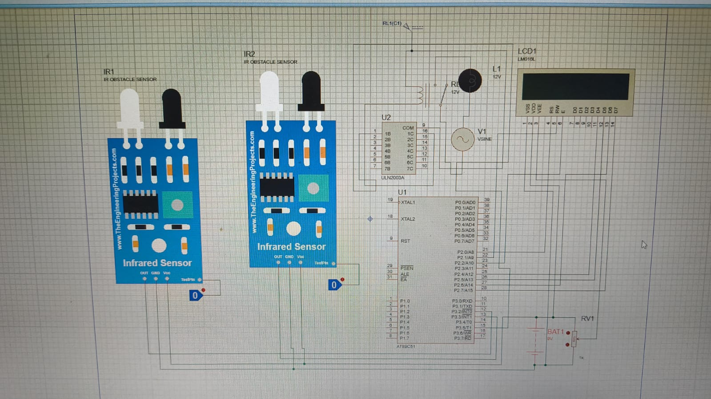

# 🔢 Automatic Visitor Counter (8051)

## 📌 Overview

This project is an embedded system designed to automatically count the number of people entering and exiting a room using IR sensors and an 8051 microcontroller. The system updates the count in real time on a 16×2 LCD display and controls a relay-based bulb depending on occupancy.

---

## ⚙️ Features

* Bidirectional visitor counting (Entry & Exit)
* Real-time display on 16×2 LCD
* Automatic light control using relay
* Interrupt-based detection using INT0 & INT1
* Prevents negative counting
* Compact and cost-effective design

---

## 🧠 Working Principle

* Two IR sensors are placed at entry and exit.
* If entry sensor is triggered → count increments.
* If exit sensor is triggered → count decrements.
* The count is continuously displayed on LCD.
* If count > 0 → bulb turns ON
* If count = 0 → bulb turns OFF

---

## 🔌 Hardware Components

* 8051 Microcontroller (AT89C51)
* IR Sensor Modules (2)
* 16×2 LCD Display
* ULN2003 Driver IC
* Relay Module
* Potentiometer (for LCD contrast)
* Resistors
* 5V Power Supply

---

## 💻 Software

* Language: Embedded C
* IDE: Keil µVision
* Programming: 8051 Programmer

---

## 📸 Project Visuals

### 🔌 Circuit Schematic

---

### 🧩 PCB Layout Design
.jpeg)

---

### 🛠️ Final Hardware Implementation

---

## 🚀 Future Improvements

* IoT-based remote monitoring
* Mobile app integration
* Occupancy analytics dashboard
* Smart building automation integration

---

## 👨‍💻 Author

Harsh Maurya

